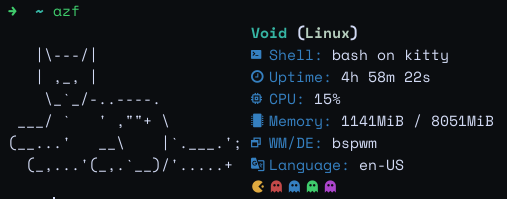

# 💐 azf

a simple rust-based tool for fetching system information

you need a patched [nerd font] and the [material design icons font] 

[nerd font]: https://github.com/ryanoasis/nerd-fonts/tree/master/patched-fonts
[material design icons font]: https://github.com/Mangeshrex/rxfetch/raw/main/ttf-material-design-icons/materialdesignicons-webfont%20(1).woff

